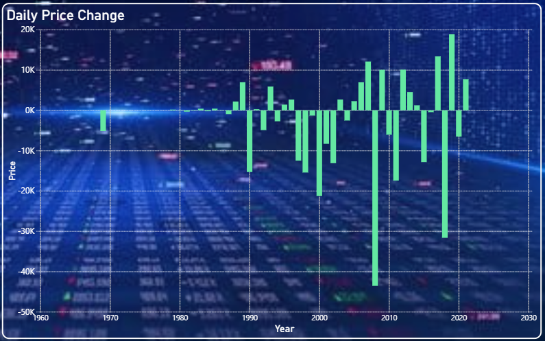
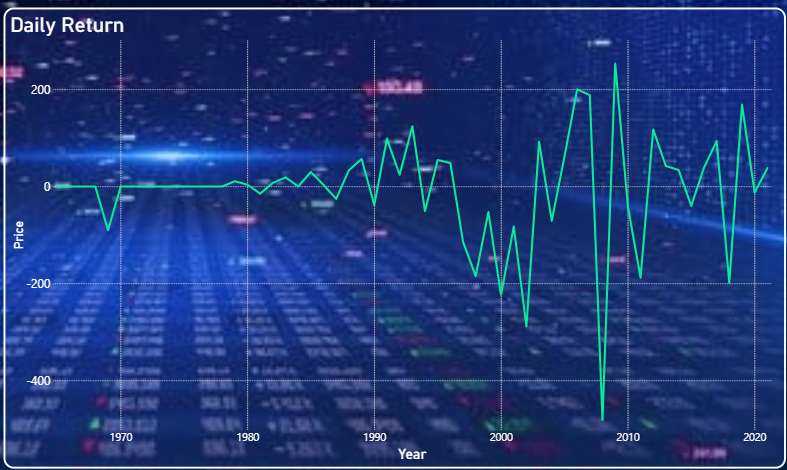
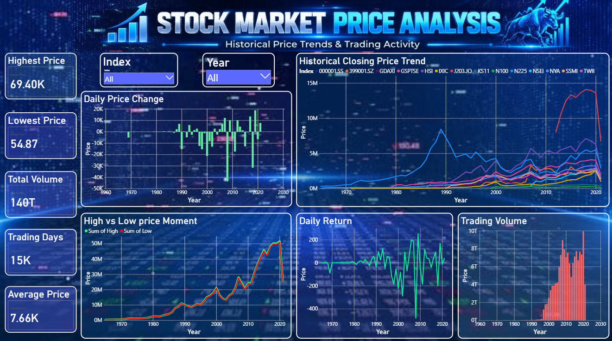
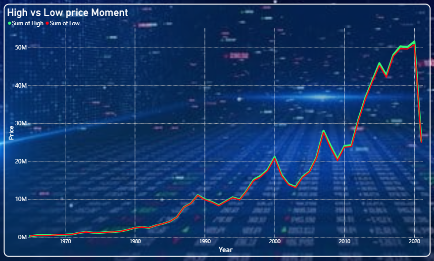
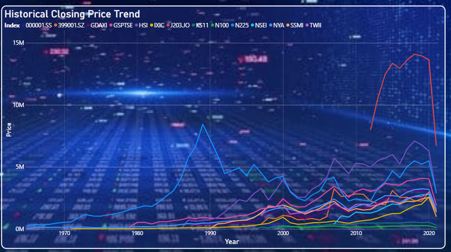
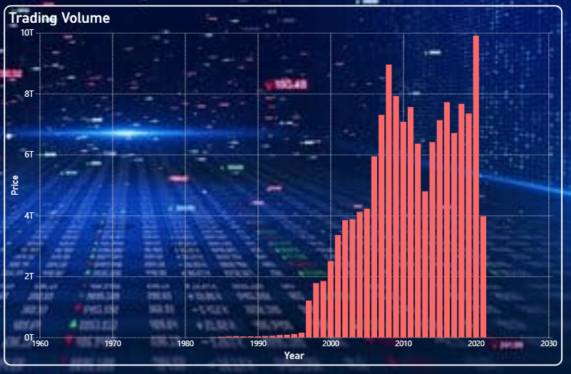

# Simple-Stock-price-Visualization
Interactive Power BI dashboard for analyzing historical stock market prices, daily returns, price movements, and trading volume using time-series data.
## 📊 Project Overview

This project uses the **Market Historical Stock Data** dataset containing **112,457 records** of historical stock market information.

The dashboard provides an interactive way to analyze:

- Historical stock price trends
- Daily price changes
- Daily returns
- High and low price movements
- Trading volume
- Trading days
- Average price
- Highest and lowest prices
- Market trends across different years and indices

---

## 📁 Dataset Description

**Dataset Name:** Market Historical Stock Data  
**File Name:** `Market.csv`  
**File Format:** CSV  
**Data Type:** Time-Series Data  
**Total Records:** 112,457

### Dataset Attributes

| Attribute | Description |
|-----------|-------------|
| Index | Stock market index |
| Date | Trading date |
| Open | Opening price |
| High | Highest price |
| Low | Lowest price |
| Close | Closing price |
| Adj Close | Adjusted closing price |
| Volume | Number of shares traded |

The dataset is used to analyze historical stock price movements, trading activity, and market trends over time.

---

## 🛠️ Tools & Technologies

- **Microsoft Power BI** – Dashboard development and visualization
- **CSV / Microsoft Excel** – Dataset handling
- **Time-Series Visualization**
- **Data Analysis**
- **Data Visualization**

---

## 📈 Dashboard Analysis

### 1. Daily Price Change

The Daily Price Change visualization shows the positive and negative changes in stock prices across different years. It helps identify periods of significant price increases and decreases.



---

### 2. Daily Return

The Daily Return visualization represents the variation in daily stock returns over time. It helps observe periods of positive and negative returns and overall price volatility.



---

### 3. Main Dashboard

The main Power BI dashboard provides an interactive overview of the stock market data.

It includes:

- Highest Price
- Lowest Price
- Total Volume
- Trading Days
- Average Price
- Daily Price Change
- Historical Closing Price Trend
- High vs Low Price Movement
- Daily Return
- Trading Volume

The dashboard also provides filters for **Index** and **Year** for interactive analysis.



---

### 4. High vs Low Price Movement

This visualization compares the aggregated high and low prices across different years. It helps identify major changes in historical price movements.



---

### 5. Historical Closing Price Trend

The Historical Closing Price Trend visualization shows the closing price movements of multiple stock market indices across different years.

It helps users compare historical trends and observe changes in market performance over time.



---

### 6. Trading Volume

The Trading Volume visualization shows the number of shares traded across different years. It helps identify periods of higher and lower market activity and provides an overview of trading volume trends over time.



---

## 🔄 Methodology

The project follows these major steps:

1. Collected the historical stock market dataset.
2. Imported `Market.csv` into Power BI.
3. Checked and organized the dataset.
4. Formatted the Date field for time-series analysis.
5. Analyzed Open, High, Low, Close, Adj Close, and Volume values.
6. Created calculated measures and visualizations.
7. Designed an interactive Power BI dashboard.
8. Added filters for Index and Year.
9. Analyzed historical price trends and market movements.
10. Interpreted the visualizations to identify meaningful patterns.

---

## 🎯 Project Objectives

- To analyze historical stock market data.
- To visualize stock price movements using time-series visualization.
- To identify trends and fluctuations in stock prices.
- To analyze daily price changes and returns.
- To compare high and low price movements.
- To analyze trading volume and market activity.
- To present financial data in a simple and meaningful graphical format.

---

## 📂 Project Structure

```text
Stock-Market-Price-Analysis/
│
├── DV_Project_1.pbix
├── Market.csv
├── README.md
│
└── images/
    ├── Daily_Price_Change.png
    ├── Daily_Return.png
    ├── Dashboard.png
    ├── High_vs_Low.png
    └── Historic_closing_price_trend.png
